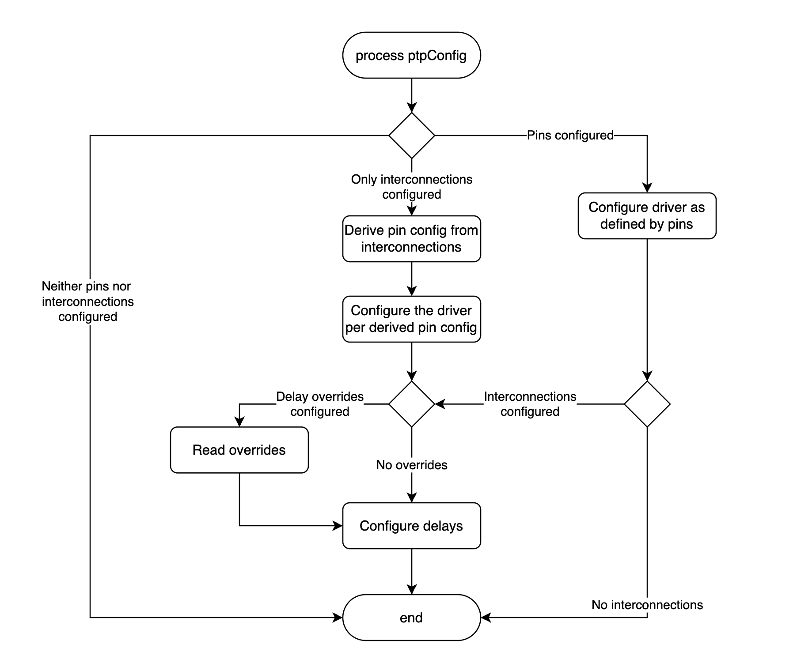

# Unify Pins and Interconnections APIs
## Summary

Improve hardware plugin pin API to include the interconnection topology, so 
- It can be used both for configuring pin directions and delay compensation
- Will suit any card topology or manufacturer
- Will suit any interconnection topology

## Motivation

Synchronization-enhanced network interface cards might provide phase and frequency hardware interfaces. The purposes are:
- To allow connecting of two or more cards into multi-card topologies
- To facilitate connections to an external measurement equipment or to external phase and/or frequency sources. 
 
These external connectors may need to be configured by the operator to fit the specific purpose and topology defined by user. In the simplest case the connectors of each card should be defined as inputs or outputs and enabled or disabled. In addition, interconnections between the cards must be compensated for the delays caused by cables and internal card routing, clocking and synchronization of the phase signals.

Today there are two pin APIs supported by the operator:
1. pins API - provides a list of pins for each NIC and specifies the commands that should be sent to the driver to enable or disable the pin and set its direction.
2. interconnections API - provides a model of card interconnection specifying for each card phase input and input delay, phase outputs (phase output delays are assumed to be internal delays only.)

Both APIs are implemented as a part of Intel e810 hardware plugin.

Examples of pin API settings for 3-NIC T-BC:

1. Pin API

```yaml
e810:
  pins:
  # Slot 4 outputs 1PPS from SMA1 and SMA2 to slots 5 and 8
    ens4f0:
      SMA1: 2 1
      SMA2: 2 2
      U.FL1: 0 1
      U.FL2: 0 2
    ens5f0:
      SMA1: 1 1
      SMA2: 2 2
      U.FL1: 0 1
      U.FL2: 0 2
    ens8f0:
      SMA1: 1 1
      SMA2: 2 2
      U.FL1: 0 1
      U.FL2: 0 2
```

1. Interconnections API

```yaml
e810:
  interconnections:
  - id: ens5f0
    part: E810-XXVDA4T
    inputPhaseDelay:
      connector: SMA1
      delayPs: 920
      phaseOutputConnectors:
      - SMA2
  - id: ens4f0
    part: E810-XXVDA4T
    gnssInput: false
    phaseOutputConnectors:
    - SMA1
    - SMA2
  - id: ens8f0
    part: E810-XXVDA4T
    inputPhaseDelay:
      connector: SMA1
      delayPs: 920
      phaseOutputConnectors:
      - SMA2

```   

There are multiple problems with the current solution for pin configuration:
1. Both APIs are a part of the `e810` hardware plugin. To support other manufacturers this code will need to be duplicated for every manufacturer
2. The interconnections API contains everything currently included in the pin API, so using both APIs could be seen as duplication
3. The internal delays are hardcoded per part number. This might create a maintenance burden to extend them for multiple cards and keep these up-to-date. 

### User Stories
- As a user I want to avoid duplication of hardware configurations, so my configuration will be more compact and less error-prone
- As a user I want to be able to use NICs of several manufacturers interconnected in the same system, so I can reach my business goals
- As a user I want to use a single API that will allow me configuring all the aspects of frequency and phase interfaces, so I can configure the supporting I/O to be frequency, phase or eSync input or output and build a flexible multi-NIC topology.
- As a user I want to be able to override the hardcoded internal delay numbers, so I can configure the internal delays for a new card, or adapt existing settings to my custom environment
- As a user I want the combination of APIs verified for validity and the system fails in case of error, so I can fix the error fast

### Goals

- Ensure the interconnections API is suitable for T-BC
- Make pins API optional if the interconnections API is configured.
  - If both APIs are configured, use the pins API to configure the E-810 through the driver, and interconnections API to configure the delays through the DPLL API.
- Provide a new API for overriding the hardcoded cards and their internal delays with user-defined cards and delays.  

### Non-Goals
To be considered for future development:
- Modification of current T-GM functionality
- Support of non-Intel hardware plugins or plugins other than e810 (file a separate EP)
- Support of 10MHz / eSync on the pins (Check if needed and file a separate EP)

## Proposal
1. Add an option for to specify generic cards with non-default internal delays
2. Make the pins API optional
3. Verify for consistency


### Workflow Description



The user will configure pins and /or interconnections in the PtpConfig (hardware plugin section) as described above.
If internal delay overrides are required, they can be configured together with the interconnections, as per this example:

```yaml
e810:
  internalDelays:
  - awesome-NIC:
    externalInputs: # The direction of input is from connector to pin
    - connector: SMA1
      pin: SMA1
      delayPs: 7658
    - connector: SMA2
      pin: SMA2/U.FL2
      delayPs: 7385
    - connector: u.FL2
      pin: SMA2/U.FL2
      delayPs: 9795
    externalOutputs:  # The direction of output is from pin to connector
    - pin: REF-SMA1
      connector: u.FL1
      delayPs: 1274
    - pin: REF-SMA1
      connector: SMA1
      delayPs: 1376
    - pin: REF-SMA2/U.FL2
      connector: SMA2
      delayPs: 2908
    gnssInput:
      connector: GNSS
      pin: GNSS-1PPS
      delayPs: 6999
    interconnections:
    - id: ens5f0
      part: awesome-NIC
      inputPhaseDelay:
        connector: SMA1
          delayPs: 920
      phaseOutputConnectors:
      - SMA2
    - id: ens4f0
      part: E810-XXVDA4T
      gnssInput: false
      phaseOutputConnectors:
      - SMA1
      - SMA2
    - id: ens8f0
      part: E810-XXVDA4T
      inputPhaseDelay:
        connector: SMA1
        delayPs: 920
      phaseOutputConnectors:
      - SMA2
```
In the above case the ens4f0 delays will be overridden, while ens4f0 / ens8f0 delays will remain default
#### Error handling
Following input errors will be checked and lead to daemon exit with an informative log entry about the nature of the error.
- The consistency between the pins and interconnections will be checked.
- The DPLL devices present correspond to the interfaces defined in the pins and interconnections


### Implementation Details/Notes/Constraints


### Risks and Mitigations


### Drawbacks


## Open Questions [optional]

This is where to call out areas of the design that require closure before deciding
to implement the design.  For instance,
 > 1. This requires exposing previously private resources which contain sensitive
  information.  Can we do this?

## Test Plan

**Note:** *Section not required until targeted at a release.*


## Alternatives


## Infrastructure Needed [optional]

Use this section if you need things from the project. Examples include a new
subproject, repos requested, github details, and/or testing infrastructure.
