# PTP Simulation Infrastructure: netdevsim + gnss-sim

Hardware-free PTP Telecom Grandmaster (T-GM) simulation and testing
infrastructure. Enables end-to-end CI tests — including GNSS signal
loss/recovery, clock class transitions, and cascading holdover — without
physical GNSS receivers or Intel E810 NICs.

## Glossary

| Acronym | Definition |
|---------|------------|
| ACK | Acknowledgment (UBX response frame) |
| API | Application Programming Interface |
| BC | Boundary Clock (PTP node that acts as both master and slave) |
| CC | Clock Class (ITU-T quality level, e.g., CC6 = locked) |
| CFG | Configuration (UBX message class 0x06) |
| CI | Continuous Integration |
| DGPS | Differential GPS (enhanced accuracy GPS) |
| DPLL | Digital Phase-Locked Loop (hardware clock synchronization component) |
| DR | Dead Reckoning (position estimation without satellite fix) |
| EEC | Ethernet Equipment Clock (ITU-T G.8262 synchronization standard) |
| EXTTS | External Timestamp (PTP hardware clock input event) |
| FIFO | First In, First Out (kernel buffer queue) |
| GGA | GPS Fix Data (NMEA 0183 sentence type for position and fix quality) |
| GM | Grandmaster (PTP clock hierarchy root) |
| GNSS | Global Navigation Satellite System (GPS, GLONASS, Galileo, BeiDou) |
| GNGGA | Multi-constellation GGA sentence (GN = multi-GNSS talker ID) |
| GNRMC | Multi-constellation RMC sentence (Recommended Minimum data) |
| GPZDA | GPS Time and Date sentence |
| HTTP | Hypertext Transfer Protocol |
| IRQ | Interrupt Request |
| iTOW | GPS Time of Week in milliseconds (UBX NAV-CLOCK field) |
| MON | Monitor (UBX message class 0x0A) |
| NAV | Navigation (UBX message class 0x01) |
| NIC | Network Interface Card |
| NMEA | National Marine Electronics Association (text protocol for GPS data) |
| OC | Ordinary Clock (PTP endpoint, either master-only or slave-only) |
| OVS | Open vSwitch (software network switch) |
| PCI | Peripheral Component Interconnect (hardware bus standard) |
| PPS | Pulse Per Second (1 Hz timing signal from GNSS) |
| PTP | Precision Time Protocol (IEEE 1588) |
| PTY | Pseudo-Terminal (virtual serial port pair) |
| SyncE | Synchronous Ethernet (ITU-T G.8261, frequency sync over Ethernet) |
| tAcc | Time Accuracy estimate in nanoseconds (UBX NAV-CLOCK field) |
| TAI | International Atomic Time (monotonic timescale, no leap seconds) |
| T-GM | Telecom Grandmaster (ITU-T G.8275.1 PTP profile, GNSS-locked) |
| TGM | Telecom Grandmaster test mode (T-GM only) |
| TGMBC | Telecom Grandmaster + Boundary Clock test mode |
| TGMOC | Telecom Grandmaster + Ordinary Clock test mode |
| UBX | u-blox proprietary binary protocol (for GNSS receiver control) |
| VLAN | Virtual Local Area Network (IEEE 802.1Q) |
| WPC | Westport Channel (Intel E810 ICE NIC series with DPLL/GNSS support) |

---

## 1. Architecture

### 1.1 Kernel Simulation Layer

The netdevsim module creates all hardware-equivalent devices when a device
is registered with `wpc=1`:

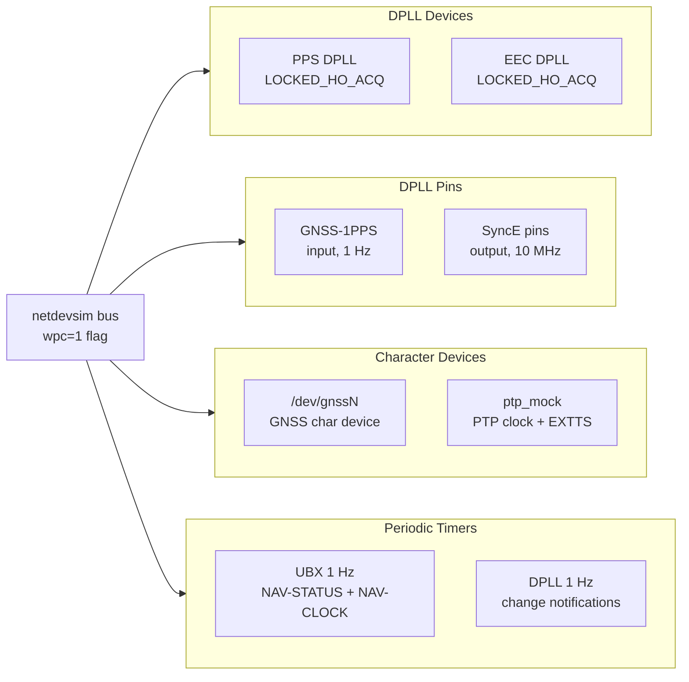

### 1.2 Data Flow: NMEA and Clock Synchronization

gnss-sim (built from source, runs on the host) generates NMEA sentences
and writes them into `/dev/gnssN`. The kernel echoes them to readers and
parses GGA fix quality to drive UBX responses:

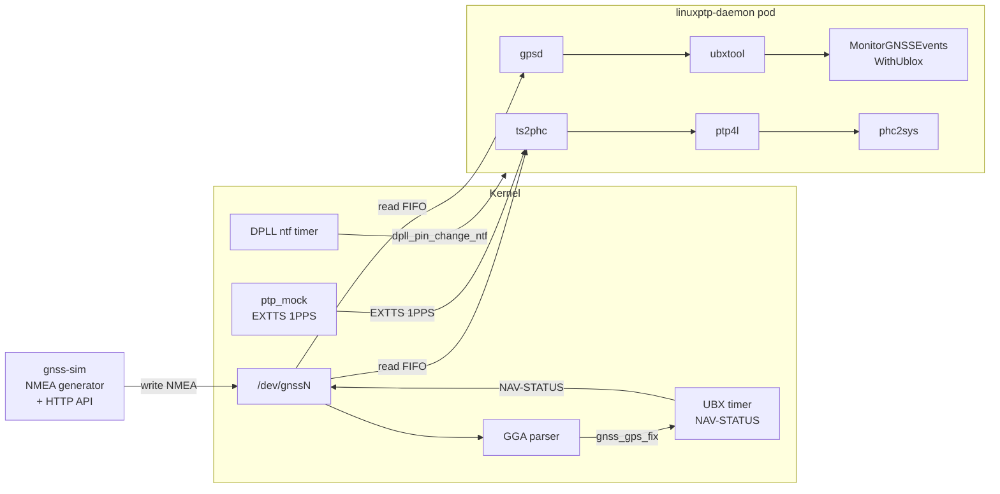

### 1.3 Event Pipeline and Test Orchestration

GNSS state changes propagate through cloud events to a test consumer.
The Ginkgo test suite drives signal loss/recovery via the gnss-sim HTTP
API and observes results through metrics and the event consumer:

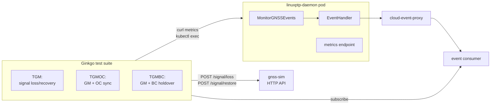

---

## 2. Kernel: netdevsim DPLL/GNSS/UBX

**File:** `drivers/net/netdevsim/dpll.c`

### 2.1 DPLL Emulation

A pair of DPLL devices is registered when a netdevsim device is created
with `wpc=1`:

```
echo "1 0001:1f:01.0 1 1 1 1" > /sys/bus/netdevsim/new_device
                                          ^-- wpc flag
```

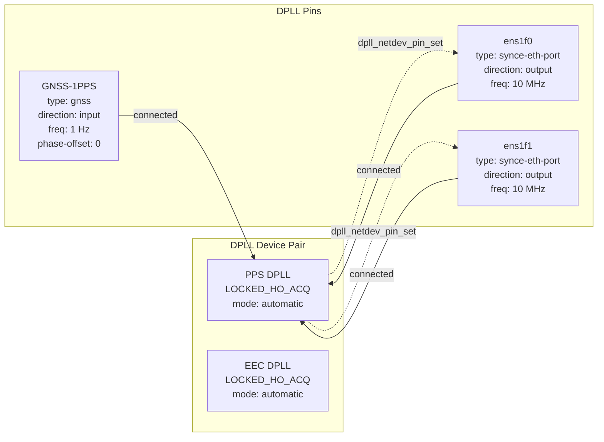

**Pin operations:**

| Op | GNSS pin | SyncE pins |
|----|----------|------------|
| `frequency_get` | 1 Hz | 10 MHz |
| `direction_get` | input | output |
| `state_on_dpll_get` | connected | connected |
| `phase_offset_get` | 0 | 0 |

### 2.2 Virtual GNSS Device and UBX Protocol

A `gnss_device` is registered on the same PCI parent as the netdevsim NIC,
creating `/dev/gnssN`. The `write_raw` callback processes two protocols:

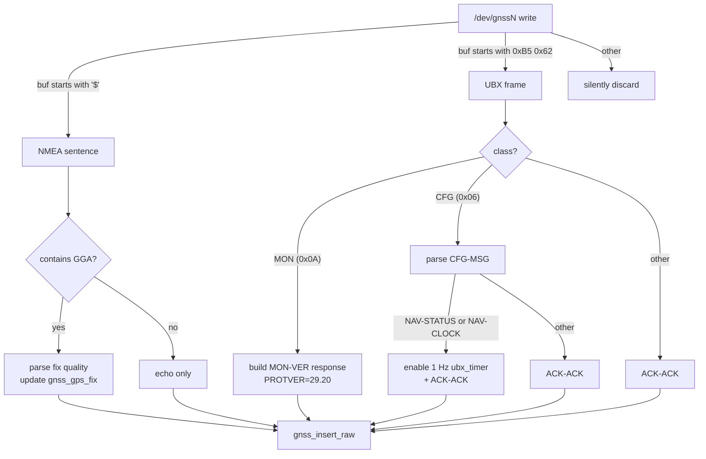

**UBX periodic timer (`ubx_timer`):**

Once enabled by a CFG-MSG write, a 1 Hz `hrtimer` fires and injects:

1. **NAV-STATUS** (class=0x01, id=0x03, 16-byte payload) — contains `gpsFix`,
   flags, time-to-first-fix
2. **NAV-CLOCK** (class=0x01, id=0x22, 20-byte payload) — contains iTOW,
   clock bias, drift, tAcc, fAcc

Both are inserted via `gnss_insert_raw()` under `gnss_lock` spinlock.

### 2.3 Dynamic gpsFix from NMEA GGA

The GGA parser (`nsim_parse_gga_fix`) scans the write buffer for any
`$??GGA` sentence and extracts fix quality from field 6. The buffer may
contain multiple concatenated NMEA sentences (e.g., GNRMC + GNGGA + GPZDA
in a single write), so the parser searches for `$` markers rather than
only checking the first byte.

**GGA-to-gpsFix mapping:**

| GGA Quality (field 6) | Meaning | UBX gpsFix | NAV-STATUS flags |
|------------------------|---------|------------|------------------|
| 0 | Invalid / no fix | 0x00 (NoFix) | 0x00 |
| 1 | GPS fix | 0x03 (3D) | 0x0D (gpsFixOk + wknSet + towSet) |
| 2 | DGPS fix | 0x03 (3D) | 0x0D |
| 6 | Estimated (DR) | 0x01 (Dead Reckoning) | 0x00 |
| other | — | 0x03 (3D) | 0x0D |

When `gpsFix < 2`, NAV-CLOCK `tAcc` is set to 999,999 ns instead of 10 ns.
This causes the daemon's `isOffsetInRange()` check to also trigger FREERUN,
matching real hardware behavior during signal loss.

### 2.4 DPLL Notification Timer

A separate 1 Hz `hrtimer` defers `dpll_device_change_ntf` and
`dpll_pin_change_ntf` calls to a workqueue (`ntf_work`). This is necessary
because:

- The DPLL notification functions acquire a mutex (cannot be called from
  hard-IRQ context)
- Late-joining userspace consumers (linuxptp-daemon starting after device
  creation) need to receive initial pin state including phase offset

Notifications use `genlmsg_multicast_allns` to deliver to all network
namespaces, so daemons in Kind cluster worker containers receive them.

### 2.5 PTP Mock EXTTS

**File:** `drivers/ptp/ptp_mock.c`

The mock PTP clock provides external timestamp (EXTTS) capability for
ts2phc, which requires a hardware 1PPS input pin.

| Feature | Value |
|---------|-------|
| Pins | 2 (pin 0: "NONE", pin 1: "GNSS1PPS") |
| EXTTS channels | 1 |
| Initial time | `ktime_get_real_ns()` (wall clock) |
| EXTTS timer | 1 Hz hrtimer, TAI-aligned timestamps |

The EXTTS timer generates `PTP_CLOCK_EXTTS` events with timestamps aligned to
the TAI second boundary (`ktime_get_clocktai_ns()` rounded down). This gives
ts2phc an offset of approximately 0 ns.

### 2.6 Device Creation Flow

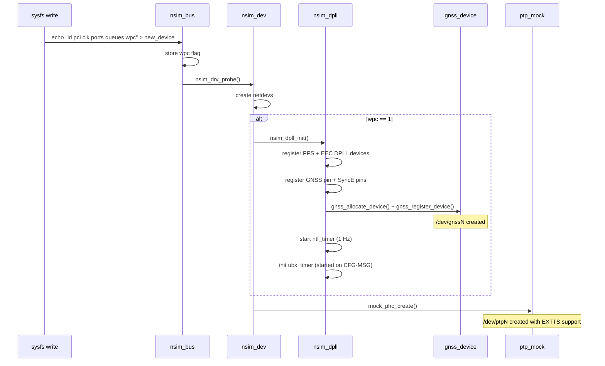

### 2.7 Signal Loss/Recovery Data Flow

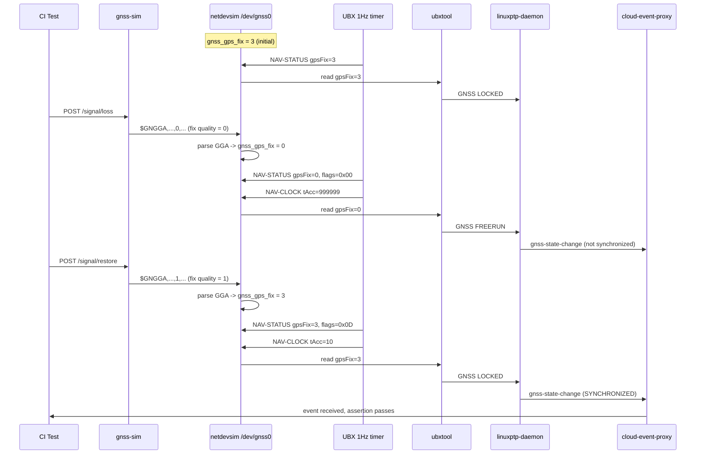

---

## 3. gnss-sim

**Source:** `ptp-tools/gnss-sim/`

A userspace Go tool that simulates a GNSS receiver, generating NMEA
sentences at 1 Hz and providing an HTTP API for test control.

### 3.1 Output Backends

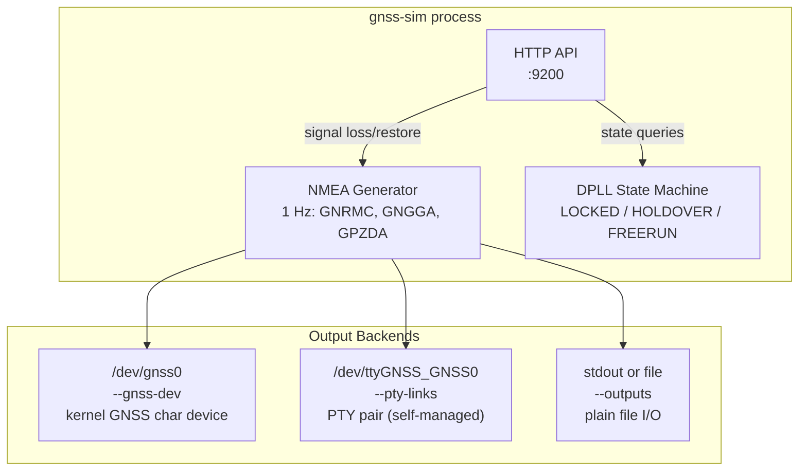

Each NMEA sentence is written individually (one `Write()` call per sentence)
to ensure the kernel's GGA parser sees each sentence at the start of a buffer.

**PTY self-management (`pty.go`):** Creates PTY pairs directly using kernel
ioctls (`TIOCGPTN`, `TIOCSPTLCK`) on `/dev/ptmx`, with symlinks like
`/dev/ttyGNSS_GNSS0 -> /dev/pts/N`. Writes use `syscall.Write` with
`O_NONBLOCK` — `EAGAIN` and `EIO` are silently dropped so the simulator
loop never stalls when no reader is attached.

**Kernel GNSS device (`--gnss-dev`):** Opens the kernel GNSS character
device and writes NMEA sentences directly. The kernel's `gnss_insert_raw()`
relays them into the device's read FIFO, so ts2phc and gpsd reading the
same `/dev/gnss0` receive the stream natively. `openGNSSDev()` polls for
device appearance with a 30-second timeout to handle the race between
kernel module loading and gnss-sim startup.

### 3.2 Deployment

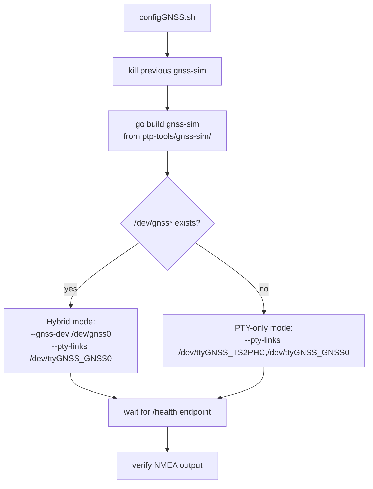

gnss-sim is built directly from source (`go build`) and runs natively on
the host. This avoids devpts namespace isolation issues where PTY pairs
created inside a container are invisible to Kind worker nodes that share
the host devpts.

---

## 4. Network Topology

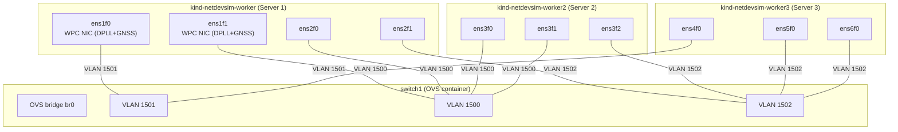

Server 1 (worker) has the WPC NIC with `wpc=1` — DPLL + GNSS emulation is
active on ens1f0 and ens1f1. The `configpair.sh` script's 10th argument
enables this.

The PTP daemon DaemonSet mounts host `/dev` into the linuxptp container so
it can access `/dev/gnssN`. The E810 plugin bundle is always applied because
the kernel virtual GNSS device responds to the UBX protocol, so
gpsd/ubxtool initialization succeeds without real hardware.

---

## 5. Test Modes

| Mode | Topology |
|------|----------|
| `tgm` | WPC T-GM only (signal loss/recovery, clock class transitions, cloud events) |
| `tgmoc` | WPC T-GM + downstream OC (same LAN) |
| `tgmbc` | WPC T-GM + BC slave + BC master + optional downstream OC (cascading holdover) |

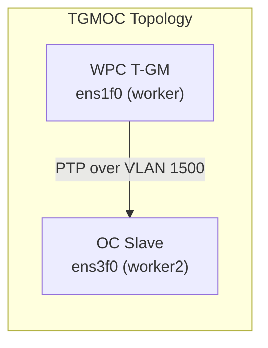

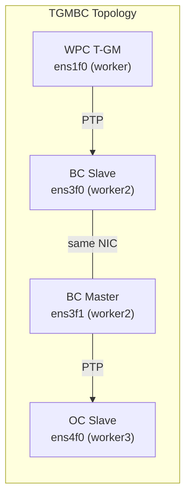

**Test coverage:**

| Context | Test | What it verifies |
|---------|------|-----------------|
| TGM | Signal loss/recovery events | GNSS state change, clock class 6 -> 7 -> 248 -> 6, cloud events |
| TGM | Process status | ts2phc, ptp4l, phc2sys, gpsd running |
| TGM | Clock state via metrics | `openshift_ptp_clock_class` reaches 6 |
| TGM | DPLL state via gnss-sim API | DPLL reports LOCKED |
| TGMOC | GM process status + CC6 | ts2phc, ptp4l, phc2sys running; clock class reaches 6 |
| TGMOC | Downstream OC sync | OC slave synchronized to WPC T-GM |
| TGMBC | GM + BC reach Locked CC6 | Both GM and BC achieve clock class 6 |
| TGMBC | Cascading holdover on GNSS loss | Signal loss degrades GM CC, BC cascades; restore recovers both |

---

## 6. Kernel Selftests

### dpll.sh

| # | Test | Validates |
|---|------|-----------|
| 1 | module load | netdevsim loads cleanly |
| 2 | no DPLL before create | clean slate |
| 3 | device creation | `wpc=1` triggers DPLL init |
| 4 | DPLL enumeration | PPS + EEC devices exist |
| 5 | lock status | all `locked-ho-acq` |
| 6 | mode | all `automatic` |
| 7 | module-name | `netdevsim` |
| 8 | pin enumeration | GNSS + SyncE pins |
| 9 | GNSS pin props | `GNSS-1PPS`, input, connected |
| 10 | phase offset | 0 |
| 11 | frequency | 1 Hz |
| 12 | SyncE pin props | output, connected, 10 MHz |
| 13 | SyncE pin count | matches port count |
| 14 | GNSS char device | `/dev/gnssN` exists |
| 15 | GNSS sysfs discovery | netdev -> gnss path |
| 16 | NMEA loopback | write NMEA, read it back |
| 17 | UBX MON-VER | `PROTVER=29.20` response |
| 18 | binary discard | non-NMEA/non-UBX dropped |
| 19 | NMEA+UBX interleave | both protocols coexist |
| 20 | periodic NAV | CFG-MSG enables NAV-STATUS + NAV-CLOCK |
| 21 | default gpsFix | gpsFix=3, flags=0x0D before any NMEA |
| 22 | GGA fix loss | `$GNGGA,...,0,...` sets gpsFix=0, flags=0x00 |
| 23 | GGA fix restore | `$GNGGA,...,1,...` restores gpsFix=3, flags=0x0D |
| 24 | GGA batch write | batched GNRMC+GNGGA in single write still updates gpsFix |
| 25 | teardown | DPLL + GNSS cleaned up |
| 26 | stress | 3x create/destroy cycles |

Uses Python helpers `extract_gps_fix()` and `extract_nav_flags()` to parse
binary NAV-STATUS frames from capture files.

### ptp_mock.sh

PTP clock creation, dual-pin configuration, EXTTS event generation,
timestamp accuracy validation.
